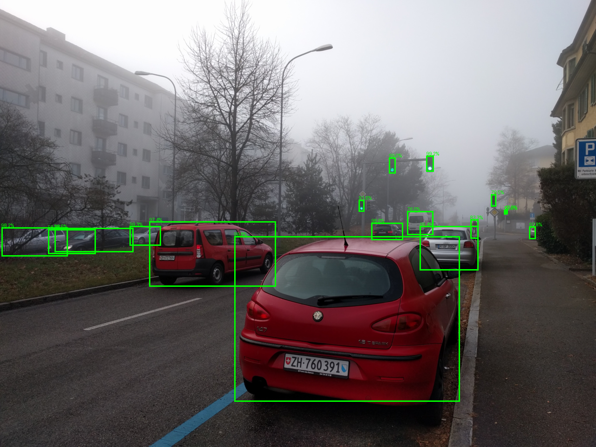

# Autonomous Driving Fog Detection using Faster R-CNN

## 📌 Overview

This project performs object detection on foggy images using a pre-trained Faster R-CNN (ResNet-50 FPN) model from PyTorch’s torchvision library.

The goal is to detect vehicles and objects under reduced visibility caused by fog — a key challenge in autonomous driving perception systems.

---

## 🔍 Model Used

- **Faster R-CNN (ResNet-50 FPN)**
- Pre-trained on COCO dataset
- Implemented using PyTorch and Torchvision

---

## 🛠 Methodology

1. Load foggy images
2. Convert images to tensor format
3. Run inference using the pre-trained model
4. Apply confidence threshold (> 0.4)
5. Draw bounding boxes and detection probabilities
6. Save output images

---

## 🧠 Technologies Used

| Component | Tool / Library |
|-----------|----------------|
| Language  | Python |
| Model     | PyTorch Faster R-CNN |
| Transform | Torchvision |
| Image I/O | PIL (Pillow) |

---

## 📸 Sample Output

Below is an example of foggy input image and its detection output:

**(https://github.com/Shalemrsju4092004/Autonomous-Driving-Fog-Detection/blob/main/sample_images/foggy_output.png)**

---

## 🚀 How to Run

1. Clone the repository:

2. Go to project folder:

3. Install dependencies:

4. Update image directory paths in `main.py`

5. Run script:

---

## 🧪 Applications

- Autonomous driving perception under poor visibility  
- Foggy environment object detection benchmarking  
- Safety systems for driver assistance

---

## 🔮 Future Improvements

- Train a custom detector on foggy datasets  
- Compare performance across fog intensities  
- Add dehazing pre-processing

## 📸 Sample Output

